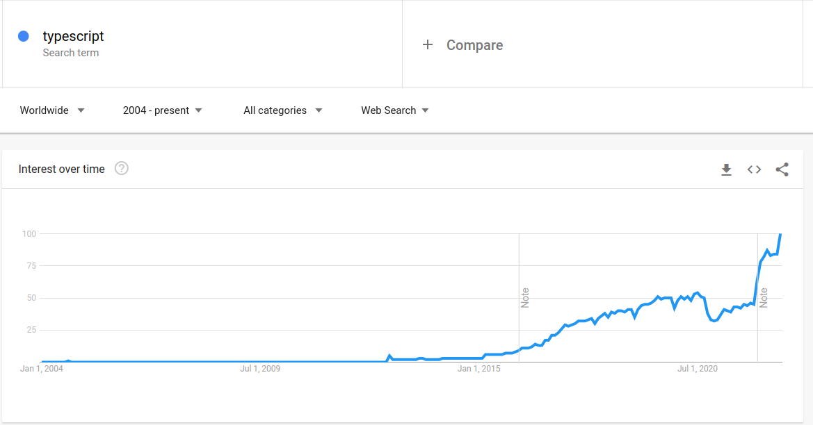
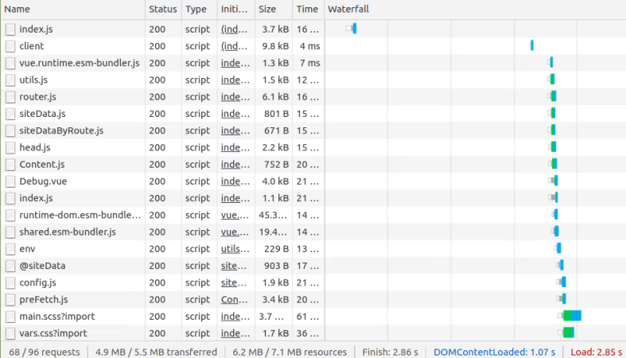

# Arriving at Laravel Vite<div class="mt-10 text-2xl">A brief history of bundling<br> and what the future holds</div>

<div class="opacity-80 text-sm absolute -bottom-2 right-10">Presentation By Harlan Wilton </div>

<!--
- Welcome everyone, great to be back at a meetup. First one I've been too

- Today I wanted to talk about Vite. Sure you've all heard of it by now.

- I've spent a lot of time in the frontend space for the last couple of years and it's been pretty interesting to see how Vite has progressed

- With Laravel 9 adopting Vite, I thought it might be worth sharing a refresher on frontend space, specifically around bundling

- But also looking at where things are now and where it's headed

- I've tried to keep it simple and  high level but let me know if you have any questions
-->

---
layout: two-cols
size: lg
image: https://source.unsplash.com/collection/94734566/1920x1080
---

# About Me

::left::

- Freelancer / Open Source Dev
- Building in the Vue, Nuxt and Vite ecosystems
- On the <windi-icon /> WindiCSS and <logos-vue /> VueUse teams
- Sponsored by <logos-nuxt-icon /> Nuxt

<div class="opacity-85 text-sm mt-10">Follow me <logos-twitter /> @harlan_zw</div>

::right::


<!--
- My name is Harlan
- Living in Canberra currently
- Been doing open-source for over a year now
- If you use Twitter, then you should definitely give me a follow
-->

---
layout: two-cols
---

# Quick Glossary (in simple terms)

::left::

## Bundling

1. With some assets (js, css, images, etc)
1. Maybe transform them
2. And give them a good smooshing (minify, concat)

- Basis of optimising assets in the browser

::right::

## Module

- Some code that exports something that you can import
- In PHP you could consider a class a module
- Sticks to a standard

<!--
- Very quickly want to give you a glossary of these terms in case they're completely new to
- think any file is going to be a module

- module is a term that you come accross when working with javascript packages OR frontend bundlers such as webpack

- we'll go through these a bit more later so all good if that doesn't make sense
-->

---
class: text-center
layout: section
---

# Travel back in time...

Look at how we've solved the bundling problem through the ages

<!--
- Now let's get into it

- We're going to go back in time and see how we've dealt with bundling over the ages
-->

---
layout: two-cols
size: sm
---

# Stone Age: Birth of Tooling


**Tools**: <logos-html-5 /> HTML 5, <logos-css-3 /> CSS 3, jQuery, Bootstrap, <logos-sass /> Sass, maybe your IDE helped you

**Module Standard**: IIFE

### Innovations

::left::

- No build step ⚡ INSTANT START ⚡
- No node_modules, download dependencies 🙃

::right::

- Manually run most tools if your IDE didn't for you (concats, minifies, autoprefixers, validators)
- Caching?

<!--
- We are back in time, to the Stone age. 

- When we had no tools

- Everything was manual, you'd google minify css or minify js and copy the output

- It was a pretty nice time though no build steps, no node_modules, just downloaded the dependencies we needed

- Caching wasn't really a thing

- We use modules which are called IIFE

- We don't talk about anything before the stone age
-->

---
layout: section
size: xl
---

# IIFE (Immediately Invoked Function Expression)

```javascript {all|1,7|2}
(function () {
  window.$myLib = {
    greeting() {
      console.log('Hello world!')
    }
  }
})();
```

```html
<script src="./myLib.js" type="text/javascript" />
<script>
$myLib.greeting()
</script>
```

<!--
- Immediately Invoked Function Expressions

- You may have seen these, this is how popular libraries were packaged, they would add their APIs to the global scope

- Think jQuery or bootstrap

- Very simple, just run the code and let it do its thing
-->

---
layout: section
size: sm
---

# HTML Example

```html {all|4-5,10}
<!DOCTYPE html>
<html>
<head>
  <link rel="stylesheet" type="text/css" href="./css/style.css" />
  <script type="text/javascript" href="./lib/jquery-2.1.3.min.js" />
  <title>My cool app</title>
</head>
<body>
    <!--  ... -->
    <script type="text/javascript" src="./App.js" />
</body>
</html>
```

<!--
- A  basic example of what it looked like, pretty easy and nice
- so the jQuery there would be an IIFE module
-->

---
layout: section
size: xl
---

# Stone Age Problems

- Many cross browser bugs
- Unoptimised code
- IIFE modules eager loading and global scope
- Manually refresh the page!

<!--
- It did have some notable issues though

- The browser engines were way out of sync, you'd run into a lot of issues when testing between the browsers of what was supported, what needed vendor prefixes, etc

- Websites were slow, while generally they had less scripts than today, the surrounding optimisations were minimal

- IIFE were very difficult to optimise and you could run into conflicts within the global scope

- Of course, had to manually refresh the page when making code changes, although some IDEs did have solutions for that
-->

---
layout: section
---

<div class="h-full flex items-center">

</div>

<!--
- This is the representation of a Stone Age web developer

- While it was extra manual work to optimise things, it wasn't too complicated, not a bad time

- Who amongst us is was part of this? Maybe you still build your sites like this?
-->

---
layout: two-cols
size: sm
---

# Bronze Age: It's a Web App Actually

**Tools**: <logos-grunt /> Grunt, <logos-gulp /> Gulp, <logos-browserify-icon /> Browserify, <logos-bower /> Bower, <logos-require /> Require.js, <logos-laravel /> Laravel Elixir

**Module Standards**: CJS, AMD, UMD, IIFE

::left::

- Pipeline paradigm
- Watch for changes, rebuild and automatic refreshes!
- Start of the great module wars

::right::

- Lots of competing module standards
- Dependency management with Bower
- CSS pre-processors take on wide adoption

<!--
- Now we enter the bronze age

- The era of "It's a web app actually", our web tools are getting better and more complicated as the scope of our websites grow

- Lot of interesting tools as you can see there, Laravel Elixer is worth noting which was an abstraction of gulp, similar to Laravel Mix but for Laravel 4/5

- The paradigm was on "Task Running", so having a pipeline of tasks to execute things

- So begins in the Bronze age the great Module wars, as you can see there, we now have four competing module types

- Let's see what different they have
-->

---
layout: section
size: xl
---

# CJS (CommonJS) - Node Standard

```javascript {all|1}
modules.exports.greeting = function() {
  console.log('Hello world!')
}
```

```javascript {all|1}
const $myLib = require('./myLib.js')
$myLib.greeting()
```

Note: The browser **does not** understand this code. Node does understand this.

<!--
- CommonJS modules were the original way to package JavaScript code for Node.js.
- A browser does not understand this so would need to be transpiled
- Fairly easy to optimise
-->

---
layout: section
---

# AMD (Async Module Definition) - Browser Standard

```javascript {all|1}
define(function () {
    return {
        greeting: function () {
            console.log('Hello world!')
        }
    };
});
```

```javascript {all|1}
const $myLib = require('./myLib.js')
$myLib.greeting()
```

Note: The browser **does** understand this code.

<!--
- AMD was developed by Require.js
- It did work in the browser but wasn't easy to optimize, no transpiling needed
-->

---
layout: section
size: xl
---

# UMD (Universal Module Definition)

```javascript myLib.js
(function (root, factory) {
    if (typeof define === 'function' && define.amd) {
        define([], factory);
    } else if (typeof module === 'object' && module.exports) {
        module.exports = factory();
    } else {
        root.returnExports = factory();
  }
}(typeof self !== 'undefined' ? self : this, function () {
    return {
      greeting () { console.log('Hello World') }
    };
}));
// ...
const $myLib = require('./myLib.js')
$myLib.greeting()
```

Note: The browser and Node understands this code.

<!--
- UMD was a way to ship a package that could be used from AMD or CommonJS module
- Bit complex and hacky
-->

---
layout: section
---

# Pipeline Paradigm (gulp)

```ts
const source = './src/js/*.js';

src(source)
  .pipe(changed(source))
  .pipe(concat('bundle.js'))
  .pipe(uglify())
  .pipe(rename({
    extname: '.min.js'
  }))
  .pipe(dest('./assets/js/'))
  .pipe(browsersync.stream());
```

<!--
- Example of the pipeline paradigm in which we were in
-->

---
layout: two-cols
---

# Bronze Age Problems

- Many competing tools and module standards
- Task runners are not intuitive and painful to configure
- Builds are slow, full rebuilds needed for code changes
- The ecosystem is not efficient, hard for packages to leverage each other's code

<!--
- bit of frustration out of this age, package authors were fighting against the standards
- devs were struggling to configure these task runners
- build times were slow
- Overall the ecosystem wasn't efficient
-->

---
layout: section
---

<div class="h-full flex items-center">

</div>

<!--
- yup this is us now, bit frustrating
-->

---
layout: two-cols
size: sm
---

# Iron Age: Webpack Time

**Tools**: <logos-webpack /> webpack, <logos-babel /> Babel, <logos-npm-icon /> NPM

**Module Standards**: CJS, AMD, UMD, IIFE 

### Innovations

::left::

* Dev Server with Hot Module Replacement
* Code Splitting
* Tree Shaking

::right::

- Dependency graph resolving
- NPM and babel are now the norm
- CJS exports becomes the norm, AMD and UMD losing favour


---
layout: section
size: sm
---

# Quick Glossary (in simple terms)

## Dev Server (Hot Module Replacement)

- Use a HTTP server to serve modules locally (listening on port 3000, 8080 usually)
- Websocket communicating file changes so modules can be reloaded

---
layout: section
size: sm
---

# Quick Glossary (in simple terms)

## Code Splitting

- Split your code into multiple bundles to optimise performance
- Dynamic imports
- e.g. separate pages js/css into their own bundles (network requests)

---
layout: section
size: sm
---

# Quick Glossary (in simple terms)

## Tree Shaking

- Remove dead code
- e.g. Use a single function from lodash instead of loading the entire package

---
layout: section
---

# Loaders Example

```ts {all|5-6,9-14}
module.exports = {
  module: {
    rules: [
      {
        test: /\.js$/,
        loader: 'babel-loader',
      },
      {
        test: /\.s?css$/i,
        use: [
          'style-loader',
          'css-loader',
          'sass-loader',
        ],
      },
    ],
  }
}
```

<!--
- this is an example of a webpack config file (common js)
- you can see here we set rules on which rules should go through which loaders
-->

---
layout: two-cols
size: xs
---

::left::

# Iron Age Problems

- Incredibly painful to understand, configure and debug webpack
- Dev-server and HMR builds do not scale well, very slow
- Lots of boilerplate


---
layout: section
---

<div class="h-full flex items-center">

</div>

<!--
- we thought we were very clever and we did some solve big issues with webpack, but the developer experience was getting worst in some ways
-->

---
layout: two-cols
size: sm
---

# Middle Ages: Solving Webpack

**Tools**: <logos-webpack /> Webpack 5, <logos-rollup /> Rollup, <logos-esbuild /> esbuild, <logos-typescript-icon /> TypeScript,  <logos-laravel /> Laravel Mix, <logos-nuxt-icon /> Nuxt, <logos-nextjs-icon class="bg-white px-1px rounded" /> Next

**Module Standards**: ESM, CJS, AMD, UMD, IIFE

### Innovations

::left::

- Powerful abstraction layers (Mix, Nuxt, Next, etc)
- Much less boilerplate, things _just work_
- Esbuild speeds things up a lot, more focus on building better optimised tools in other languages

::right::

- ESM modules start gaining some interest, exporting CJS is now the standard
- Rollup provides a much nicer API than webpack
- TypeScript demand is high

<!--
- Middle ages I characterise as the age of solving webpack

- Solving the complexity of configuring, which showed itself through abstraction layers and frontend frameworks, such as Laravel Mix, Nuxt, Next, etc

- Babel which was a core loader of webpack had performance issues which people wanted to solve, specifically esbuild

- With the ecosystem now using each others packages more, we needed a stricter way and less buggy way to communicate package APIs, hense the shift of things towards TypeScript

- Rollup grew out of the frastrations of the webpack API and documentation
-->

---
layout: section
size: xl
---

# ESM / MJS (ECMAScript module) - ES6

```javascript {all|5}
function greeting () {
  console.log('Hello world!')
}

export { greeting }
```

```javascript {all|1}
import { greeting } from './myLib.js'

// Hello World
greeting()
```

Note: Node understands this. Browsers will eventually understand this with time and some magic.


---

# Esbuild Performance


<!--
- esbuild is just insanely fast
-->

---



<!--
- typescript usage had a slow growth but has really exploded
-->

---
layout: section
size: xs
---

# Middle Ages Issues

- Build and HMR time for mid-large size apps is becoming a problem, even with tools like esbuild
- The ecosystem is divided between webpack, Rollup and other solutions
- Module compatibility remains a frustrating topic (CJS, ESM. AMD, UMD, IIFE)

<!--
- this is specifically what Laravel Mix has issues with
- main issue is really performance for most developers, it's just too slow
-->

---

<div class="h-full flex items-center">

</div>

<!--
- all had our big brain masks on but we were still having a lot of issues
-->

---
layout: two-cols
---

# Modern Era: Just In Time

**Tools**: <logos-vitejs /> Vite, <logos-snowpack class="bg-white rounded px-2px" /> Snowpack, <logos-wmr /> WMR, <logos-deno /> Deno

**Module Standards**: ESM, CJS, AMD, UMD, IIFE

## Innovations

::left::

- Zero config solutions
- Minimal building with JIT
- Leverage native browser ESM support and caching

::right::

- Rollup taking over webpack
- New JavaScript runtimes (deno)
- Native TypeScript support default

<!--
- Welcome to the modern era, the era of things being just in time
-->

---
layout: section
---

# Vite

Tech: <logos-rollup /> Rollup,  <logos-esbuild /> esbuild, <logos-typescript-icon /> TypeScript

- Not a "bundler", rather, it's a pre-configured build environment using the Rollup bundler and a tool for local development
- "Enhanced" Native ESM
- Delivers modules one-by-one over HTTP requests rather building them all togethor
- Language agnostic

- Acts as a low-mid level layer between bundlers (Rollup) and frameworks (Laravel)

---
layout: section
---

# Vite Code

```html {all|1,3}
<script type="module">import "/vite/client"</script>
<div id="app"></div>
<script type="module" src="/@app/index.js"></script>
```

---
layout: section
---

# Vite waterfall


<div class="flex items-center">

</div>


---
layout: section
---

# Modern Era Issues

- Lots of new frameworks popping up, hard to keep accross them (Astro, Fresh, Solid, etc)
- Still quite a bit of JavaScript for basic sites
- Migration can be difficult, many stuck in the Middle ages

---

<div class="h-full flex items-center">

</div>

---
layout: two-cols
---

# Future Era: An efficient ecosystem?

**Tools**: Vite Node, Web Workers, Edge Rendering, Bun, StackBlitz, UnJS, Nuxt v3

**Module Standard**: ESM

## Innovations

::left::

- JS packages will run anywhere, without bindings for node / browser (UnJS)
- No build step
- JIT rendering on the edge
- Experimental runtimes like bun offering unparalleled speeds

::right::

- Island based reactivity, 0 js runtime overhead
- Custom runtimes supporting native TypeScript (vite-node) 
- Powerful online IDE and runtimes like StackBlitz
- CSS Pre Processors will be dropped

---

<div class="h-full flex items-center">

</div>


---
layout: section
---

# Takeaways

- Frontend has had a lot of inefficiencies over the years

- The ecosystem is getting better and aligning (at a low / mid level)

- Module standards are becoming more sane

- Browsers are now catching up

- Probably still easier to just SSR with PHP  / Laravel

<!--
# Takeaways

- Relative to the PHP world, frontend has had a lot of inefficiencies in working togethor due to competing technologies

- Things are getting better with language agnostic tools like Vite and standards being agreed on (ESM)

- CJS is slowly losing relevance but will be around for a while

- Browsers are now catching up with WebKit adoption, we'll need to do less to make code production ready
-->

---
layout: section
---

# Learn More

- Vite docs
- patak.dev blog
- Vite conf October 11th
